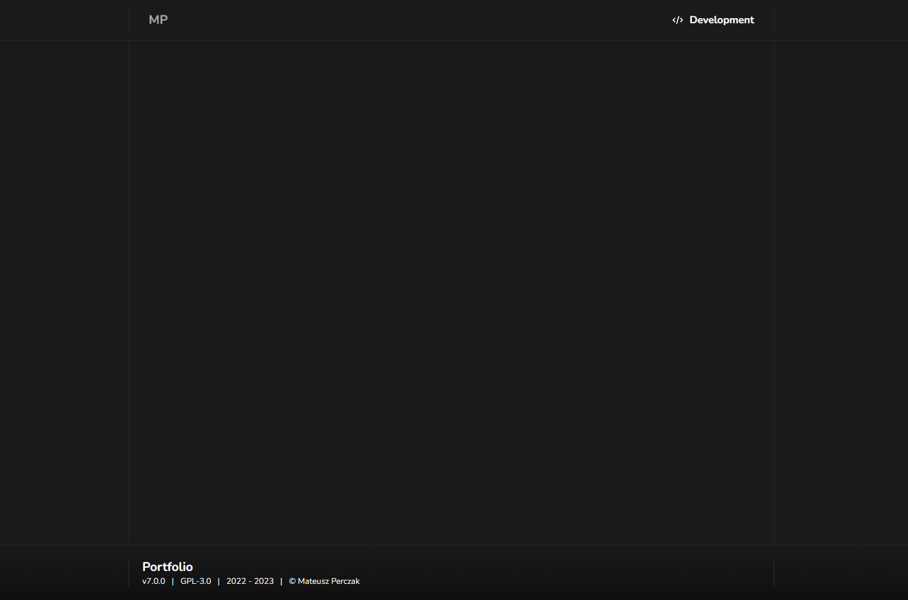

# My portfolio




## Libraries

- React
- Emotion
- react-spring
- react-reduce-motion
- react-router-dom
- react-i18next
- react-use-system-theme
- use-local-storage
- react-circle-flags

## Icons

- Segoe Fluent Icons

## Running this project

1. Install all dependencies.

```sh
yarn
```

2. Start react development server.

```sh
yarn start
```

3. Find out that this react app is using TypeScript.
4. Be impresed!
